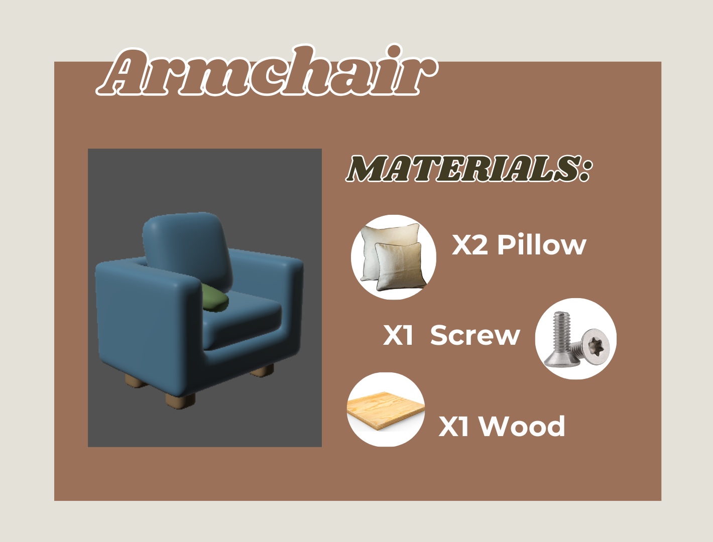
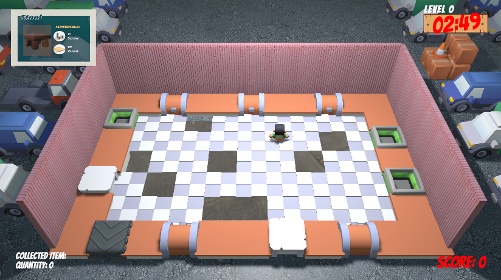

# 🎮 IkeaCraze

> Un juego con niveles generados de forma automática, donde el objetivo es craftear muebles con los materiales que recojas y entregarlos para ganar puntos.
> Durante la partida deberás esquivar obstáculos, reunir recursos y usarlos en la mesa de crafteo para fabricar tus creaciones a contrarreloj.

---

## 🏷️ Badges


---

## 🖼️ Capturas / Demo


  
  

🎥 [Ver teaser del Juego](https://vimeo.com/1117384670)  

---

## 📖 Sobre el Proyecto
Este proyecto lo desarrollamos con **Unity 3D** como práctica para la asignatura de Desarrollo de Videojuegos. Fue realizado por un grupo de 5 personas entre las cuales me incluyo.
El objetivo del proyecto era aprender sobre la generación de niveles procedurales, las mecánicas de juego y la usabilidad
El juego consiste en:  
- Género: Aventura con niveles autogenerados
- Mecánicas principales: Recolección y colocación de materiales, crafteo de muebles y esquivar obstáculos
- Objetivo del jugador: Pasar el mayor número de niveles posibles, obteniendo la máxima puntuación en cada uno de ellos.

---

## 🛠️ Tecnologías
- [Unity 2022.3.47f1](https://unity.com/)
- Lenguaje: **C#**

---

## ⚙️ Instalación / Cómo Jugar
1. Clona el repositorio:
   ```bash
   git clone https://github.com/usuario/proyecto-unity.git
2. Abre el proyecto en Unity Hub (versión recomendada: 2021.x o superior).
3. Ejecuta con ▶️ Play desde el editor.

---
🎮 Controles

- **WASD** → Mover personaje
- **Q** → Dejar objeto en la mesa de crafteo
- **E** → Cojer objeto de la mesa de crafteo
- **C** → Craftear el objeto
- **X** → Borrar objetos de la mesa de crafteo
- **Z** → Zoom sobre el personaje

